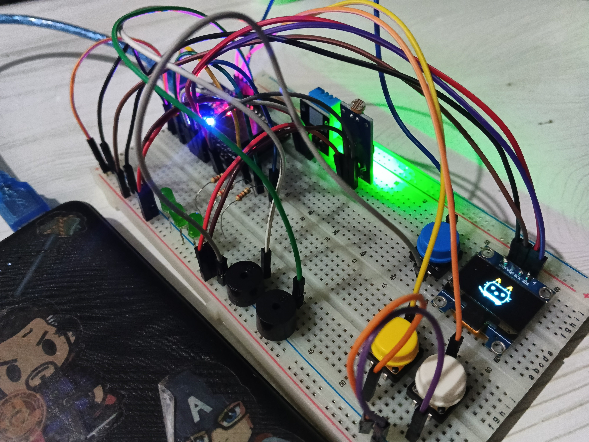
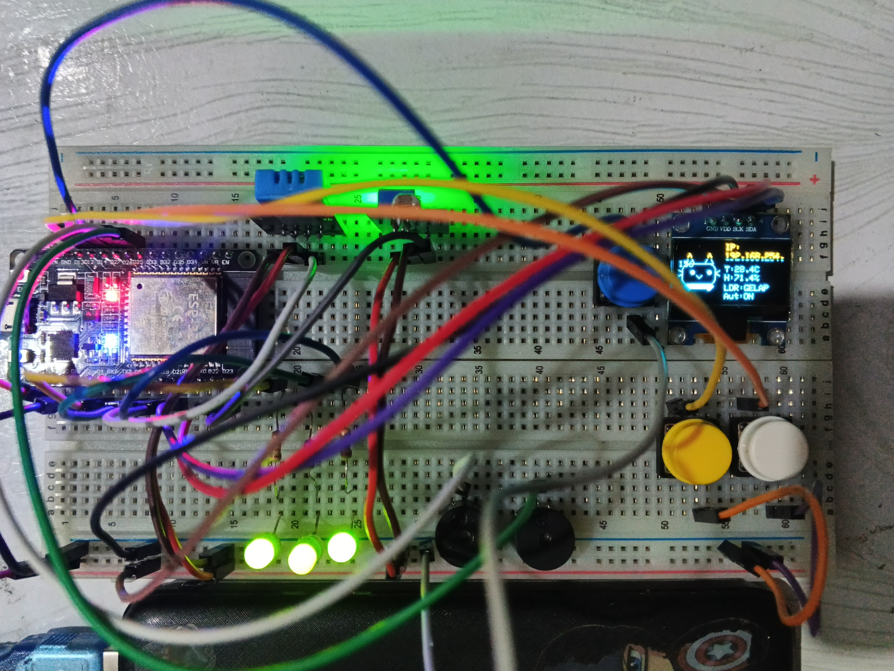
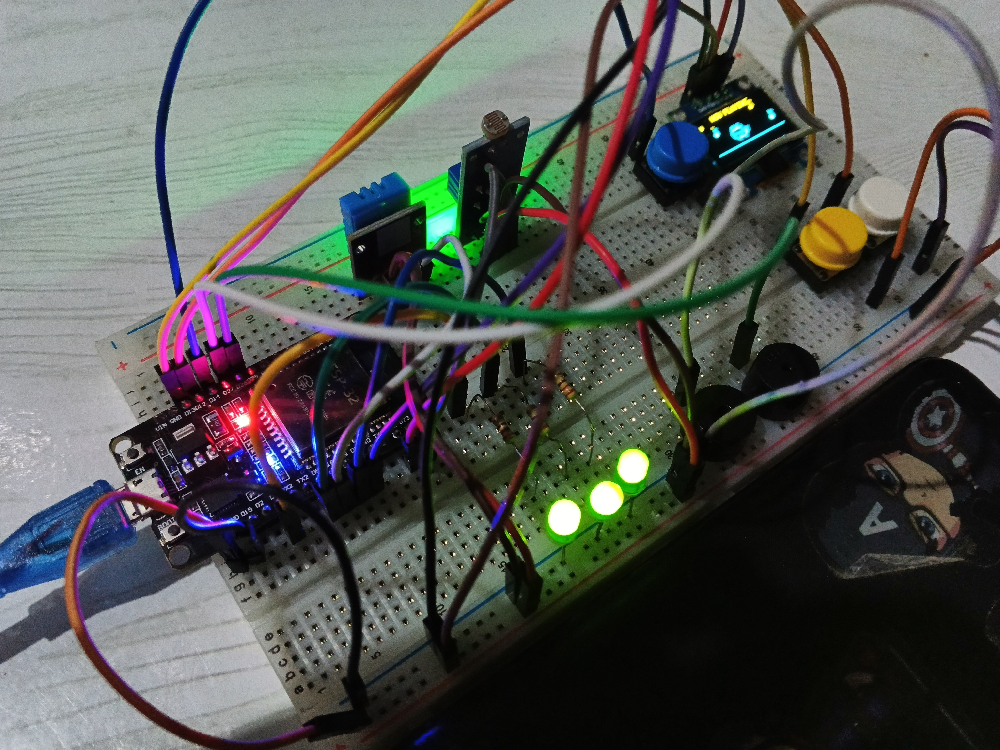
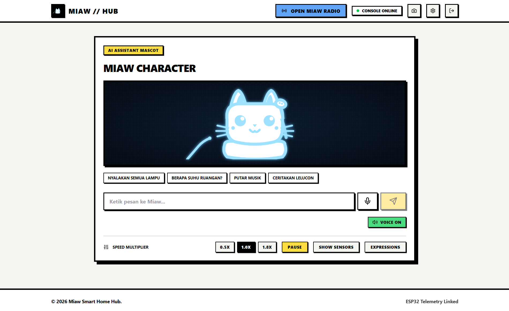
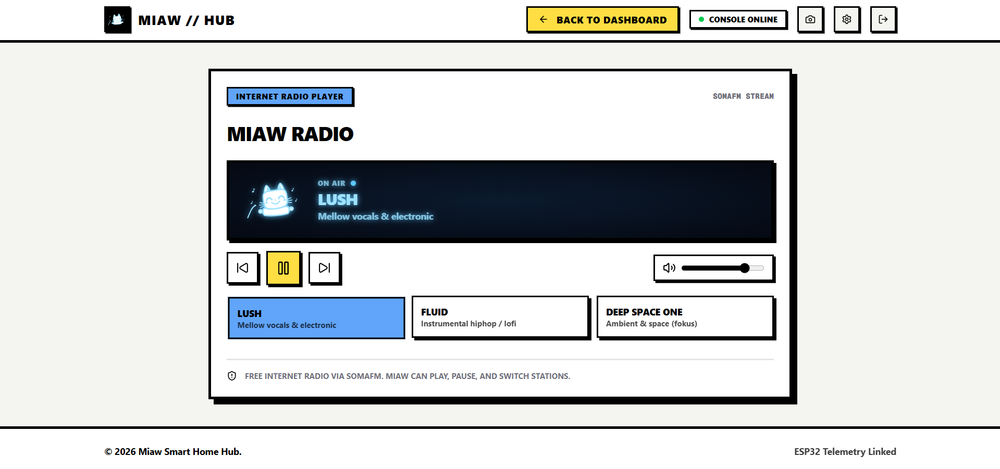

# MIAW // HUB
**The Digital Pet & Smart Home Assistant**

 

## 🐾 Apa itu Miaw?

Lebih dari sekadar layar pintar, **Miaw** adalah asisten rumah interaktif berwujud *Digital Pet* yang dirancang secara unik. Miaw tidak hanya tampil di layar web, tetapi terhubung secara fisik dengan perangkat keras berbasis **ESP32**, menjadikannya entitas yang "hidup" baik di dunia maya maupun nyata. 

Miaw dapat mendeteksi kondisi ruangan, diajak mengobrol, memutar radio internet, serta bereaksi secara langsung (*real-time*) dengan berbagai macam ekspresi wajah berkat kecerdasan buatan dari *Large Language Models* (LLM).

---

## Fitur Utama

- **LLM Brain (Groq & OpenRouter)**
  Miaw bukan sekadar bot biasa. Ia ditenagai oleh integrasi LLM super cepat menggunakan **Groq API** dan **OpenRouter**. Anda bisa mengobrol dengannya secara natural, dan Miaw akan merespons lengkap dengan emosi yang sesuai (senang, sedih, marah, tidur, dll).
  
- **ESP32 & MQTT Telemetry**
  Terhubung secara *seamless* dengan perangkat keras fisik ESP32 melalui protokol MQTT. Miaw bisa membaca data sensor secara langsung (seperti DHT11 untuk suhu ruangan dan LDR untuk intensitas cahaya). Ekspresi yang Anda lihat di web juga disinkronkan langsung ke layar OLED kecil yang ada di hardware fisik.

- **Miaw Radio (SomaFM)**
  Fitur pemutar audio bawaan yang memungkinkan Anda mendengarkan stasiun radio internet *(SomaFM)* secara langsung di latar belakang sambil berinteraksi dengan fitur lain.

- **Mini-Games & Interaktivitas**
  Tidak hanya mengobrol dan mengontrol sensor, Miaw juga dilengkapi dengan elemen *gamification* (mini-games) untuk menghilangkan kebosanan.

- **Interactive UI**
  Desain antarmuka yang sangat dinamis, berani, dan tanpa kompromi. Garis tebal, bayangan tegas (*hard shadows*), animasi *marquee*, efek suara mekanis (SFX), dan paduan warna yang menghidupkan suasana interaksi.

---

## Tampilan & Perangkat Keras

### Hardware Preview (ESP32)
Miaw di dunia nyata. Ditenagai oleh ESP32, sensor suhu, sensor cahaya, dan layar OLED untuk sinkronisasi ekspresi.

  
  
  

### Miaw Dashboard & Radio
Tampilan antarmuka utama saat Anda *login* dan mengontrol Miaw, serta tampilan pemutar Radio FM bawaan.

  
  

---

## Ekspresi Miaw

Miaw sangat ekspresif. Beberapa state/ekspresi yang didukung (baik di Web maupun di OLED hardware):
- `idleCalm`: Tenang dan santai.
- `happy`: Senang dan gembira.
- `sad`: Sedih.
- `angry`: Marah (misal ketika ruangan terlalu panas).
- `sleeping`: Tidur (jika didiamkan terlalu lama).
- `listening`: Sedang mendengarkan input suara/pesan Anda.
- `thinking`: Sedang memproses jawaban (terhubung ke LLM).
- `gaming`: Sedang sibuk bermain.

---

## Tech Stack

**Frontend:**
- [Next.js 15](https://nextjs.org/) (App Router)
- [React 19](https://react.dev/)
- [Tailwind CSS v4](https://tailwindcss.com/) (Neo-Brutalism Custom Variant)
- [Framer Motion](https://www.framer.com/motion/) & [Lucide Icons](https://lucide.dev/)

**Backend & Integrasi:**
- [Supabase](https://supabase.com/) (Realtime Database & Session Management)
- [MQTT.js](https://github.com/mqttjs/MQTT.js) (Koneksi WebSocket ke ESP32)
- **AI Providers:** [Groq](https://groq.com/) & [OpenRouter](https://openrouter.ai/)

---

## Continuous Development (Misi Jangka Panjang)

> **PROJECT IN ACTIVE DEVELOPMENT**

Proyek Miaw **tidak akan berhenti sampai di sini**. Ini adalah proyek jangka panjang yang akan terus berevolusi. Ke depannya, akan ada integrasi sensor IoT yang lebih banyak, penambahan aktuator (kontrol lampu/motor), peningkatan kapabilitas AI, serta perombakan fitur UI/UX yang lebih kaya. Miaw dirancang untuk terus tumbuh menjadi sistem *Smart Home Assistant* masa depan!

---

---

  <b>&copy; 2026 Miaw Smart Home Hub. ESP32 Telemetry Linked.</b>

